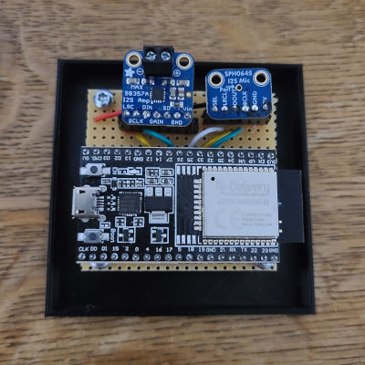
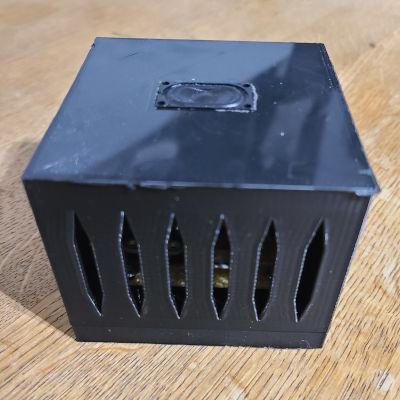

# Lotina: The machine learning powered musical soap dispenser




Musical soap dispenser is a soap dispenser that plays music while you’re rubbing
soap to your hands.

In typical musical soap dispensers, the music functionality is integrated to the
dispenser, activating when the soap is dispenser. **Lotina** (Finnish for
*squelch*) does something a little different. It’s a separate device that
records sounds and recognized when tap is opened. After detecting hand washing
by the sound of water running from tap, it starts playing music until it’s time
to rinse again.

Hence the product description: a musical soap dispenser powered by machine
learning.

## Usage

Well, as it stands now, lotina is more a collection of Python utilities than a
software package with well defined installation and usage flow. You can start
by installing the dependencies, then uploading the application to ESP32
(assuming the ESP32 is already flashed with
[micropython](https://micropython.org/)):

```
$ poetry install
$ cd ./esp32/
$ poetry run ampy --port /dev/ttyUSB0 put notes.py
$ poetry run ampy --port /dev/ttyUSB0 put main.py
$ poetry run ampy --port /dev/ttyUSB0 put lotina.conf
```

Lotina communicates via MQTT, sending samples and receiving predictions from the
ML model. Use the utilities to record audio samples of tap and other sounds, and
train the model:

```
$ poetry run python -m lotina process --label tap      # record samples from tap
$ poetry run python -m lotina process --label ambient  # record sounds that are not tap
$ poetry run python -m lotina process --label shower   # worth also training to tell shower and tap apart, etc.
$ poetry run python -m lotina train --evaluate --save
$ poetry run python -m lotina process --classify       # use the saved model
```

## The “cloud” integration

Lotina can be deployed to ~~the cloud~~ a [Raspberry Pi
4](https://www.raspberrypi.com/products/raspberry-pi-4-model-b/) running [Home
Assistant](https://www.home-assistant.io/). Why Home Assistant? Well, that’s the
one piece of software in my house I keep running at all times. And maybe it can
help later to define home automations based on the hand washing frequency, who
knows.

After building the model, copy the contents of the `homeassistant/` directory to
the `/addons` directory on the host, and install as a [local
addon](https://developers.home-assistant.io/docs/add-ons/tutorial#step-2-installing-and-testing-your-add-on).

```
rsync -avzL homeassistant/ root@homeassistant.local:/addons/lotina
```
